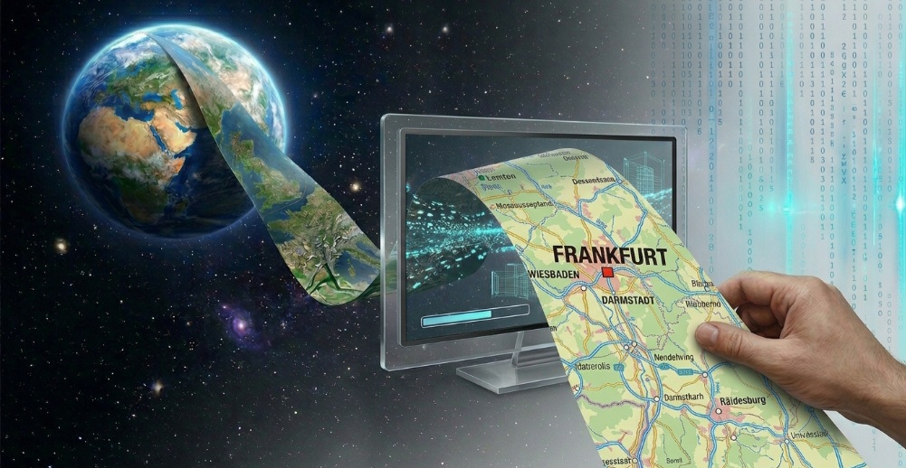

# 🌍 GeoVision Retrieval Agent



An AI-powered multi-agent application for semantic retrieval of Earth observation imagery.

## Overview

GeoVision Retrieval Agent retrieves visually similar satellite scenes instead of performing traditional image classification.

Users upload an RGB satellite image, and the system searches a reference database built from the **EuroSAT RGB dataset (Kaggle)** using deep visual embeddings. The application then retrieves the five most similar scenes and provides an AI-generated interpretation with a confidence estimate.

This project was developed for the **Kaggle AI Agents: Intensive Vibe Coding Capstone Project**.

## Features

- Semantic image retrieval
- Multi-agent architecture
- AI-generated scene interpretation
- Confidence estimation
- Interactive Streamlit interface
- Fast cosine similarity search

## Multi-Agent Architecture

### Retrieval Agent

- Image preprocessing
- Embedding generation (ResNet18)
- Cosine similarity search
- Top-5 retrieval

### Analyst Agent

- Confidence estimation
- Scene interpretation
- Retrieval consistency analysis
- Natural-language summary generation

## Supported Input

- RGB satellite images
- JPG
- JPEG
- PNG

The current version is optimized for images with visual characteristics similar to the EuroSAT RGB dataset.

## Output

For each uploaded image, the application returns:

- Top-5 visually similar satellite scenes
- Similarity scores
- Predicted land-cover category
- Confidence level
- AI-generated interpretation

## Download the Dataset

This project uses the EuroSAT RGB dataset available on Kaggle: https://www.kaggle.com/datasets/waseemalastal/eurosat-rgb-dataset

    Download the EuroSAT RGB dataset from Kaggle.
    Extract the archive.
    Create a folder named data in the project root.
    Copy the dataset into the data/ folder.

The project directory should look like:

GeoVision-Retrieval-Agent/
```text
├── data/EuroSAT/
│        ├── AnnualCrop/
│        ├── Forest/
│        ├── HerbaceousVegetation/
│        ├── Highway/
│        ├── Industrial/
│        ├── Pasture/
│        ├── PermanentCrop/
│        ├── Residential/
│        ├── River/
│        └── SeaLake/
```
The script build_embeddings.py uses the images stored in the data/ directory to generate the embedding database (embeddings.npy, labels.npy, and paths.npy).

## AI Concepts Demonstrated

- **Agent / Multi-agent system (ADK)**
- **Deployability**
- **Agent skills**

## Technologies

- Python
- Streamlit
- PyTorch
- torchvision
- NumPy
- scikit-learn
- Pillow

## Project Structure

```text
GeoVision-Retrieval-Agent/
├── app.py
├── agent.py
├── build_embeddings.py
├── embeddings.npy
├── labels.npy
├── paths.npy
├── data/EuroSAT/
│        ├── AnnualCrop/
│        ├── Forest/
│        ├── HerbaceousVegetation/
│        ├── Highway/
│        ├── Industrial/
│        ├── Pasture/
│        ├── PermanentCrop/
│        ├── Residential/
│        ├── River/
│        └── SeaLake/
├── GeoVision_banner.jpg
├── weights/
│   └── resnet18-f37072fd.pth
├── README.md
├── requirements.txt
└── .gitignore

```

## Installation

```bash
pip install -r requirements.txt
```

Download the pretrained ResNet18 weights and place `resnet18-f37072fd.pth` inside the `weights/` directory.

## Run

```bash
streamlit run app.py
```

## Current Limitations

The current version is optimized for the EuroSAT RGB dataset.

Some visually similar classes (for example River and Highway) may occasionally produce ambiguous retrieval results.

## Future Work

- Larger reference databases
- Additional Earth observation datasets
- Aerial imagery support
- Expert AI agents
- Improved semantic interpretation
- Cloud deployment
